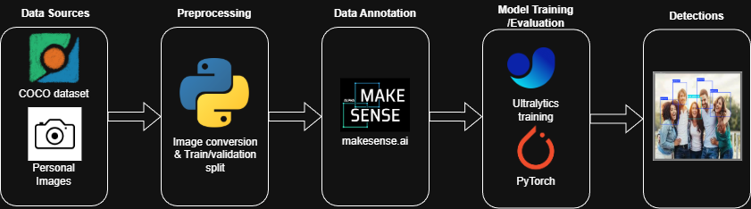

# 310-Ai-Security-System


An AI-powered security dashboard with real-time threat detection, weapon identification, and live camera monitoring. Built with a React frontend and Distributed Python backend with Docker.

---

# 🐳 Docker Commands

This is the **fastest and most reliable** way to run the system.

### 🚀 Core Commands

| Action | Command |
|--------|---------|
| **Start Everything** | `docker-compose up -d --build` |
| **Stop System** | `docker-compose down` |
| **Restart All** | `docker-compose restart` |
| **View Logs** | `docker-compose logs -f` |

### 🔄 Service-Specific Rebuilds
Use these to update specific parts of the system without restarting everything.

**Frontend, Yolo, Auth**:
```bash
docker-compose -f docker-compose.security-front.yml up -d --build frontend
```

**DVR / Logs**:
```bash
docker-compose -f docker-compose.security-back.yml up -d --build dvr-service
```

**Camera (local)**:
```bash
cd backend/services/camera
python -m venv .venv
```
```bash
source .venv/bin/activate
pip install -r requirements.txt
```
```bash
cd ~
python -m backend.services.camera.main
```

---

# 🛠️ Local Development Guide

If you need to run services natively (outside Docker) for debugging, follow this new setup guide.

## 1. Camera Service Setup

The camera service now operates independently. You must set up a specific environment for it.

### Create Virtual Environment
navigate to `backend/services/camera`:

```bash
cd backend/services/camera
python -m venv .venv
```

### Activate & Install
**Windows (PowerShell)**:
```powershell
.\.venv\Scripts\Activate.ps1
pip install -r requirements.txt
```

**Mac/Linux**:
```bash
source .venv/bin/activate
pip install -r requirements.txt
```

### Run Locally
From the `310-Ai-Security-System` directory:
```bash
python -m backend.services.camera.main
```
*Service starts on `http://localhost:8041`*

---

## 2. Frontend + Yolo + Auth + DVR Setup

You will need to set all ip addresses in the docker-compose.yml file to your local device ip address
```bash
cd 310-Ai-Security-System
docker-compose -f docker-compose up -d --build
```
---

# Recent Optimizations & Features

### Microservices Architecture
- **Distributed System**: Split into Auth, Camera, Analysis, and DVR services for maximum stability.
- **Failover**: If one service crashes, the others remain operational.

### Robust Auto-Recovery
- **Self-Healing**: The backend automatically monitors camera health.
- **Reconnection**: If a camera cable is bumped or a signal is lost, the system will **automatically attempt to restart the connection** after a short delay.

### Intelligent Detection Logic
- **Hysteresis (Persistence)**: AI must see an object for several consecutive frames (5 for people, 3 for weapons) to filter out flickering.
- **Logging Cooldown**: Prevents log spam by limiting alerts to once every 30-60 seconds for stable objects.

### Recording & Performance
- **3-Minute Segments**: Recordings are automatically rotated every 3 minutes.
- **Sticky Video Player**: Watch recordings on mobile while scrolling through the file list.
- **Automatic Log Rollover**: Daily log files are automatically created at midnight.

### Premium Mobile Experience
- **Responsive Navigation**: Automatically pivots to a single-column layout on smartphones.
- **Sticky Playback**: Video player stays pinned to the top while browsing files on mobile.
- **PWA Ready**: Supports "Add to Home Screen" with custom icons.

---

# 📂 Project Structure

```
310-AI-Security-System/
├── backend/
│   ├── services/
│   │   ├── analysis/           # YOLOv8 Inference & Overlay Service (Port 8042)
│   │   ├── auth/               # System Authentication Service (Port 8040)
│   │   ├── camera/             # Raw Video Capture Service (Port 8041)
│   │   └── dvr/                # Recording & Logging Service (Port 8043)
│   │
│   ├── shared/                 # Shared Utilities & Managers
│   │   ├── managers/           # Logic for Logs, Recordings, etc.
│   │   ├── utils/              # Helper functions
│   │   └── config.py           # Global Configuration
│   │
│   └── database/               # Database Interface
│
├── frontend/
│   ├── src/
│   │   ├── components/
│   │   │   ├── Controls.jsx    # System Control Panel
│   │   │   ├── LogsView.jsx    # Daily Log Viewer with Day Selection
│   │   │   ├── RecordingsView.jsx # Mobile-Optimized Video Browser
│   │   │   └── Sidebar.jsx     # Stats & Settings
│   │   │
│   │   ├── contexts/
│   │   ├── App.jsx             # Main Router & Layout
│   │   └── index.css           # Dark Mode & Mobile Scrolling Fixes
│   │
│   └── Dockerfile              # Nginx Production Build
│
├── recordings/                 # Video Storage
│   └── camera_X/               # Per-camera folders
│
├── logs/                       # System Logs
│   └── YYYY-MM-DD.txt          # Daily Log Files
│
├── yolo_models/                # AI Models (.pt)
├── docker-compose.yml          # Main Orchestration
├── docker-compose.security-front.yml # Frontend Stack
├── docker-compose.security-back.yml  # Backend Stack
└── README.md                   # This file
```

---

## 📸 Threat Calculation & Logging

### Example Log Output:

```
[2026-01-11 12:17:38][DETECTION](1) Person detected on Camera 2
[2026-01-11 11:41:22][INFO]Analysis Service started and connected to DVR
[2026-01-11 11:36:46][INFO]Recording started for camera 2 at 15.0 FPS (640x480 -> 480x360)
```

### Threat Scoring Logic
| Factor | Impact | Points |
|--------|--------|--------|
| Weapon detected | High | +5 per weapon |
| 1-3 people | Low | +1 point |
| >3 people | Medium | +3 points |
**Maximum**: Capped at 10

---

## System Pipeline Diagram



---

## YOLOv8 Training Guide

Quick guide to train our custom YOLOv8 model to detect any class you want in our security system can be found [here](https://youtu.be/z9F9Hssbi-4).

---

## License

This project is licensed under the MIT License.

---

## Acknowledgments

- **Ultralytics YOLOv8** - State-of-the-art object detection
- **React** - Modern UI framework
- **FastAPI** - High-performance web framework